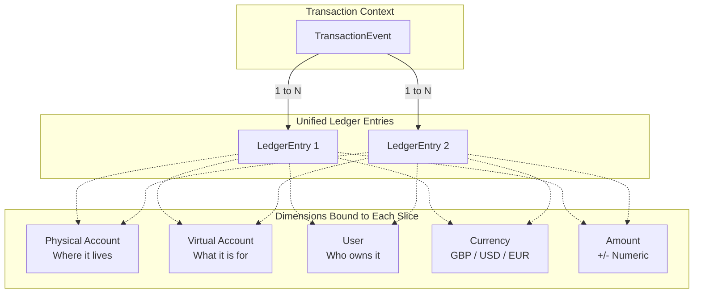

# Unified Ledger Schema Design & Query Performance Specification

This document outlines the architectural foundations, mathematical invariants, database schema design, and query optimization patterns for the Unified Ledger. It serves as the authoritative blueprint for the **Unified Allocation Ledger** powering Epic 2 (Physical Accounts Management) and Epic 4 (Transactions & Ledger).

---

## 1. Architectural Overview & The Parity Rule

The application requires tracking fractional allocations of physical assets (e.g., bank accounts, brokerages) into virtual goals (e.g., Emergency Fund, House Deposit, Wedding) across multiple users.

Rather than maintaining two separate, asynchronous ledgers (one for physical bank accounts and one for virtual envelopes), we implement a **Unified Allocation Ledger Model**. Every row in the ledger represents an atomic slice of money that simultaneously binds:
1. **Physical Location**: Where the money physically resides (`physical_account_id`).
2. **Virtual Purpose**: What financial goal or envelope the money is earmarked for (`virtual_account_id`).
3. **Legal Ownership**: Which user owns or allocated that slice (`user_id`).
4. **Currency**: Explicit currency code (`currency`) to avoid cross-currency aggregation errors.
5. **Quantity**: Signed decimal amount (`amount`).

> [!NOTE]
> **Terminology: Unified Allocation Ledger vs. Classical Double-Entry**
>
> This model is a **Unified Allocation (Projected) Ledger**, not a classical double-entry system. In classical double-entry, every transaction generates two symmetric rows (debit + credit) across separate accounts whose net always sums to zero. Here, a **single `LedgerEntry` row** simultaneously records both the physical location and the virtual objective of a money slice — the balance invariant is maintained by the Parity Rule rather than row-level debit/credit symmetry.



### The Parity Rule (Mathematical Invariant)
Because every single ledger entry carries both `physical_account_id` and `virtual_account_id`, the system guarantees by construction that within any given currency $C$:
$$\sum_{a \in \text{PhysicalAccounts}(C)} \text{Balance}(a) = \sum_{v \in \text{VirtualAccounts}(C)} \text{Balance}(v)$$

* **Physical Account Balance**:
  $$\text{Balance}_{\text{physical}}(A) = \sum \text{amount} \quad \text{WHERE } \text{physical\_account\_id} = A$$
* **Virtual Account Balance**:
  $$\text{Balance}_{\text{virtual}}(V) = \sum \text{amount} \quad \text{WHERE } \text{virtual\_account\_id} = V$$
* **User's Allocated Balance in an Account**:
  $$\text{Balance}_{\text{allocator}}(A, U) = \sum \text{amount} \quad \text{WHERE } \text{physical\_account\_id} = A \text{ AND } \text{user\_id} = U$$

---

## 2. Database Schema Definition

### Data Models (SQLAlchemy 2.0 Specification)

**Target Module**: `src/models/ledger.py`

> [!NOTE]
> The `Currency` enum and `CurrencyType` type alias referenced in this specification are **forward declarations**. They will be defined in `src/core/constants.py` as part of **Task 2.1** (Physical Accounts Domain Models). The import below reflects the intended contract, not the current state of the codebase.

```python
"""Unified Ledger database models module.

Contains the TransactionEvent and LedgerEntry ORM entities representing the immutable
unified allocation ledger.
"""

import uuid
from datetime import datetime
from decimal import Decimal
from typing import TYPE_CHECKING, Optional

from sqlalchemy import Boolean, DateTime, Enum, ForeignKey, Index, Numeric, String, func
from sqlalchemy.dialects.postgresql import UUID
from sqlalchemy.orm import Mapped, mapped_column, relationship

from src.core.constants import CurrencyType  # Defined in Task 2.1 — see src/core/constants.py
from src.db.base import Base

if TYPE_CHECKING:
    from src.models.physical_account import PhysicalAccount
    from src.models.user import User


class TransactionEvent(Base):
    """Logical grouping entity for atomic ledger transactions.

    Acts as an audit wrapper for all ledger entries created in a single operation
    (e.g., deposit, withdrawal, internal transfer, or reconciliation true-up).
    """

    __tablename__ = "transaction_event"

    id: Mapped[uuid.UUID] = mapped_column(
        UUID(as_uuid=True),
        primary_key=True,
        default=uuid.uuid4,
    )
    description: Mapped[str] = mapped_column(String(255), nullable=False)
    timestamp: Mapped[datetime] = mapped_column(
        DateTime(timezone=True),
        server_default=func.now(),
        nullable=False,
    )
    is_reversal: Mapped[bool] = mapped_column(
        Boolean,
        default=False,
        nullable=False,
    )
    reversed_by_id: Mapped[Optional[uuid.UUID]] = mapped_column(
        UUID(as_uuid=True),
        ForeignKey("transaction_event.id", ondelete="SET NULL"),
        nullable=True,
        # Semantic: set on the ORIGINAL event to point to the reversing event.
        # i.e. original_txn.reversed_by_id = reversal_txn.id
        # The reversal event sets is_reversal=True and contains sign-inverted LedgerEntries.
    )

    # Relationships
    entries: Mapped[list["LedgerEntry"]] = relationship(
        "LedgerEntry",
        back_populates="transaction",
        cascade="all, delete-orphan",
    )


class LedgerEntry(Base):
    """Atomic ledger entry recording a fractional slice of funds.

    Strictly immutable once written. All balance adjustments must occur via new entries.
    """

    __tablename__ = "ledger_entry"

    id: Mapped[uuid.UUID] = mapped_column(
        UUID(as_uuid=True),
        primary_key=True,
        default=uuid.uuid4,
    )
    transaction_id: Mapped[uuid.UUID] = mapped_column(
        UUID(as_uuid=True),
        ForeignKey("transaction_event.id", ondelete="CASCADE"),
        nullable=False,
        index=True,
    )
    physical_account_id: Mapped[uuid.UUID] = mapped_column(
        UUID(as_uuid=True),
        ForeignKey("physical_account.id", ondelete="RESTRICT"),
        nullable=False,
    )
    virtual_account_id: Mapped[uuid.UUID] = mapped_column(
        UUID(as_uuid=True),
        nullable=False,  # References virtual_account.id once Epic 3 is added
    )
    user_id: Mapped[uuid.UUID] = mapped_column(
        UUID(as_uuid=True),
        ForeignKey("user.id", ondelete="RESTRICT"),
        nullable=False,
    )
    currency: Mapped[CurrencyType] = mapped_column(
        Enum(CurrencyType, native_enum=False, length=3),
        nullable=False,
    )
    amount: Mapped[Decimal] = mapped_column(
        Numeric(precision=18, scale=2),
        nullable=False,
    )
    created_at: Mapped[datetime] = mapped_column(
        DateTime(timezone=True),
        server_default=func.now(),
        nullable=False,
    )

    # Relationships
    transaction: Mapped["TransactionEvent"] = relationship(
        "TransactionEvent",
        back_populates="entries",
    )
    physical_account: Mapped["PhysicalAccount"] = relationship(
        "PhysicalAccount",
        foreign_keys=[physical_account_id],
    )
    user: Mapped["User"] = relationship(
        "User",
        foreign_keys=[user_id],
    )

    __table_args__ = (
        # Fast physical account total balance aggregation
        Index("ix_ledger_physical_currency", "physical_account_id", "currency"),
        # Fast virtual goal total balance aggregation
        Index("ix_ledger_virtual_currency", "virtual_account_id", "currency"),
        # Allocator-specific filtered physical balance queries
        Index("ix_ledger_physical_user", "physical_account_id", "user_id"),
        # User unallocated bucket deficit checks
        Index("ix_ledger_user_virtual", "user_id", "virtual_account_id"),
    )
```

> [!IMPORTANT]
> **Deferred Referential Integrity: `virtual_account_id`**
>
> `LedgerEntry.virtual_account_id` is enforced as `NOT NULL` at the column level but **has no database-level foreign key constraint**. The `virtual_account` table does not exist until Epic 3, so the FK cannot be added without a forward dependency violation in the migration order.
>
> **Risk**: Without a DB-level FK, orphaned `LedgerEntry` records pointing to non-existent virtual accounts are possible if application-layer validation is bypassed.
>
> **Interim Guard**: Until the FK is enabled, all service-layer writes to `ledger_entry` MUST validate that `virtual_account_id` references an existing, user-owned virtual account before committing. The full FK constraint (`REFERENCES virtual_account(id) ON DELETE RESTRICT`) will be added via Alembic migration in Task 3.x when the `virtual_account` table is created.

---

## 3. Query Patterns & SQL Optimization

To guarantee sub-10ms response times for balance reads, specific composite indexes are established and raw SQL aggregation patterns are verified.

### Query 1: Physical Account Total Balance (for `OWNER` / `CO_OWNER`)
```sql
SELECT COALESCE(SUM(amount), 0.00) AS total_balance
FROM ledger_entry
WHERE physical_account_id = :physical_account_id
  AND currency = :currency;
```
*Index Used*: `ix_ledger_physical_currency (physical_account_id, currency)` (Index Only Scan).

### Query 2: Allocator-Specific Balance (for `ALLOCATOR`)
```sql
SELECT COALESCE(SUM(amount), 0.00) AS allocated_balance
FROM ledger_entry
WHERE physical_account_id = :physical_account_id
  AND user_id = :user_id
  AND currency = :currency;
```
*Index Used*: `ix_ledger_physical_user (physical_account_id, user_id)` (Bitmap Index Scan on index columns; `currency` is applied as a **post-index heap filter** — it is not covered by this index). For higher-cardinality multi-currency accounts, consider extending to a three-column index `(physical_account_id, user_id, currency)` in a future migration.

### Query 3: Multi-Account Dashboard Aggregation (Batch Load)
When loading `GET /physical-accounts/`, avoid $N+1$ queries by grouping:
```sql
SELECT 
    physical_account_id,
    currency,
    COALESCE(SUM(amount), 0.00) AS balance
FROM ledger_entry
WHERE physical_account_id = ANY(:account_ids)
GROUP BY physical_account_id, currency;
```

### Query 4: Unallocated Deficit Freeze Check
```sql
SELECT COALESCE(SUM(amount), 0.00) AS unallocated_balance
FROM ledger_entry
WHERE user_id = :user_id
  AND virtual_account_id = :unallocated_virtual_id;
```
If `unallocated_balance < 0`, the **Deficit Freeze Constraint** is active.

---

## 4. Multi-Currency & Precision Constraints

1. **Precision & Scale**: All monetary balances use `NUMERIC(18, 2)` (or Python `decimal.Decimal`). Floating-point arithmetic (`float`) is strictly prohibited.
2. **Strict Currency Homogeneity**:
   * Every `LedgerEntry.currency` MUST match its associated `PhysicalAccount.currency`.
   * All `LedgerEntry` records within a single `TransactionEvent` MUST share the same currency. Cross-currency conversion inside the ledger engine is out of scope for MVP.

---

## 5. Epic 2 Integration Blueprint

During Epic 2:
1. **Balance Read**: `PhysicalAccountService` issues Query 1 for Owners/Co-Owners and Query 2 for Allocators.
2. **Reconciliation True-Up**: `POST /physical-accounts/{id}/reconcile` computes `drift = submitted_balance - current_balance`. If non-zero, it inserts a `TransactionEvent` and a single `LedgerEntry` linking `physical_account_id`, the owner's `Unallocated` virtual account, `owner_user_id`, and `amount = drift`.
3. **Concurrency Control**: Physical account reconciliations must execute under `SELECT ... FOR UPDATE` on the `physical_account` record to prevent concurrent true-up race conditions.
